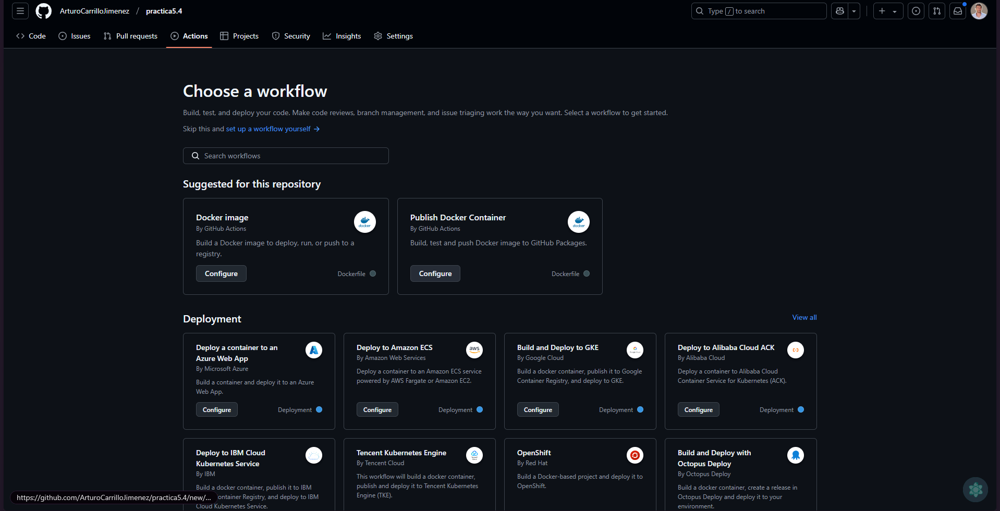
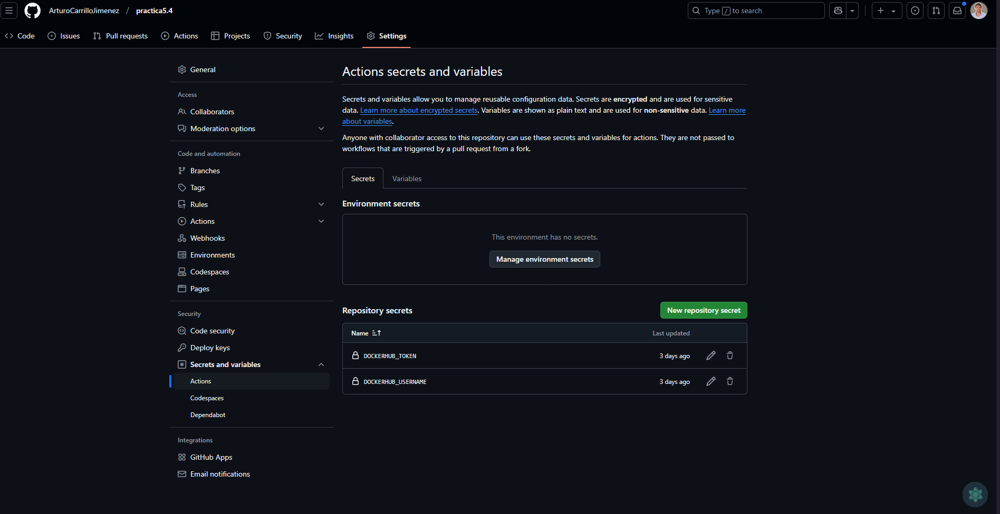
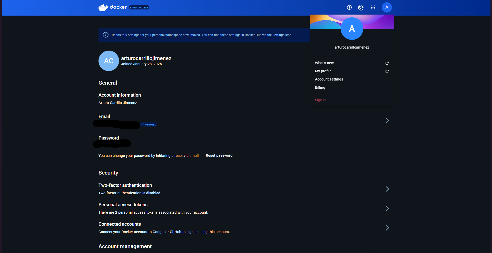
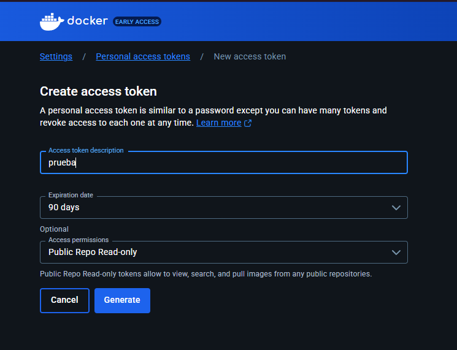
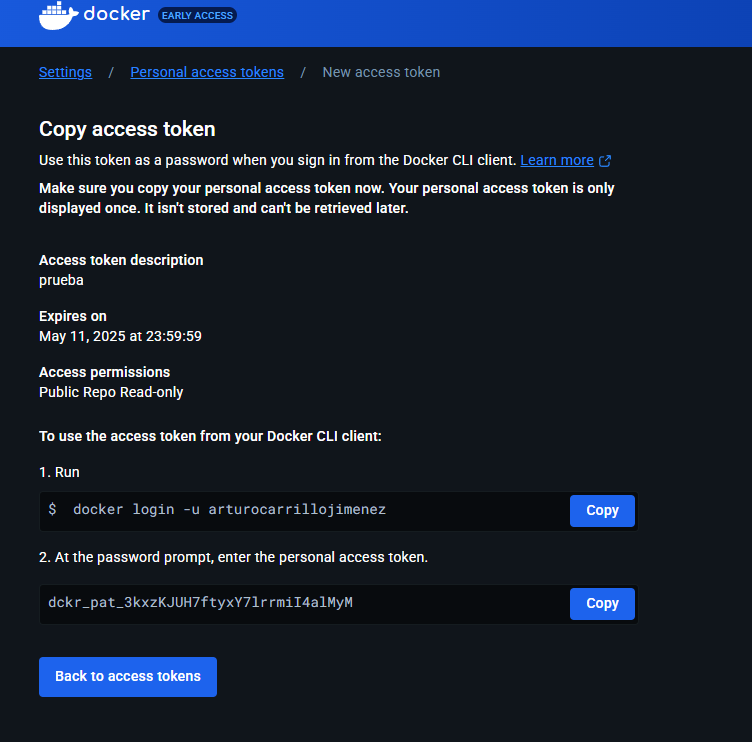
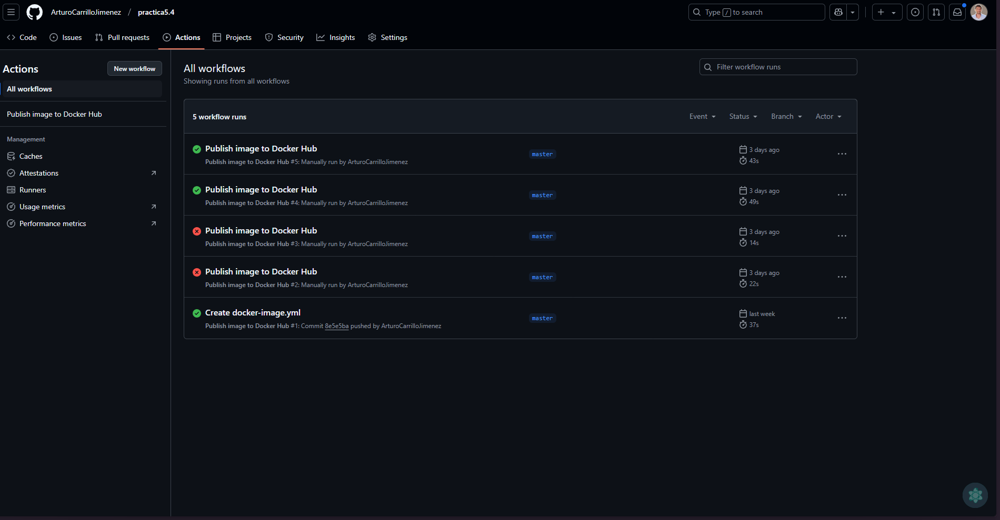

# Despliega de una aplicación web en un contenedor Docker

Vamos a desplegar una aplicación web en un contenedor Docker. La aplicación web es un juego de 2048 y subiremos la imagen a Docker Hub.

## Indice

1. [Crear el Dockerfile](#crear-el-dockerfile)
2. [Construir la imagen](#construir-la-imagen)
3. [Ejecutar el contenedor](#ejecutar-el-contenedor)
4. [Subir la imagen a Docker Hub](#subir-la-imagen-a-docker-hub)
5. [Automatizar la subida de la imagen a Docker Hub](#automatizar-la-subida-de-la-imagen-a-docker-hub)

## Crear el Dockerfile

Para este utilizaremos un servidor Ubuntu donde instalaremos el servidor web Nginx y el juego 2048 que lo obtendremos de un repositorio de GitHub.

En primer lugar, le indicamos a Docker que vamos a utilizar una imagen de Ubuntu, yo he utilizado la última versión pero para mayor compatibilidad se puede utilizar una versión específica.

```Dockerfile
FROM ubuntu:latest
```

A continuación, actualizamos los paquetes del sistema y instalamos Nginx.

```Dockerfile
RUN apt-get update && apt-get install -y nginx
```

Después, instalamos git para poder clonar el repositorio de GitHub añadiéndole el -y para que no nos pregunte si queremos instalarlo.

```Dockerfile
RUN apt-get install -y git
```

Seguidamente, elegimos el directorio donde vamos a clonar el repositorio.

```Dockerfile
WORKDIR /var/www/html
```

Para clonar el repositorio utilizamos el comando git clone y la URL del repositorio, además movemos el contenido del directorio 2048 al directorio actual y eliminamos el directorio 2048.

```Dockerfile
RUN git clone https://github.com/josejuansanchez/2048 && \
    mv 2048/* . && \
    rm -rf 2048
```

Por último, exponemos el puerto 80 y ejecutamos el servidor web Nginx.

```Dockerfile
EXPOSE 80

CMD ["nginx", "-g", "daemon off;"] 
```

De esta forma, ya tendríamos nuestro Dockerfile listo para construir la imagen.

## Construir la imagen

Para construir la imagen, utilizamos el comando docker build y le indicamos el nombre de la imagen y la versión.

```bash
docker build -t 2048:1.0 .
```

## Ejecutar el contenedor

Para ejecutar el contenedor, utilizamos el comando docker run y le indicamos el puerto que queremos exponer y el nombre de la imagen.

```bash
docker run -d -p 8080:80 2048:1.0
```

Una vez ejecutado el contenedor, podemos acceder a la aplicación web en la dirección http://``IP_SERVER``.

## Subir la imagen a Docker Hub

Docker Hub es un servicio en la nube que nos permite subir nuestras imágenes de Docker para poder compartirlas con otros usuarios.

Para subir la imagen a Docker Hub, primero tenemos que hacer login con el comando docker login y le indicamos nuestro usuario y contraseña.

```bash
docker login
```

Después, etiquetamos la imagen con nuestro usuario de Docker Hub y la versión.

```bash
docker tag 2048:1.0 arturocarrillojimenez/2048:1.0
```

Por último, subimos la imagen a Docker Hub.

```bash
docker push arturocarrillojimenez/2048:1.0
```

De esta forma, ya tendríamos nuestra imagen subida a Docker Hub y lista para ser utilizada por otros usuarios.

## Automatizar la subida de la imagen a Docker Hub

Para automatizar la subida de la imagen a Docker Hub, podemos utilizar GitHub Actions. Para ello vamos a ``github.com`` y entramos en ``nuestro repositorio`` donde tenemos el Dockerfile.

Una vez dentro, vamos a la pestaña ``Actions`` y seleccionamos la opción de ``New workflow``.

Aquí se nos abrirá la pestaña de ``Choose a workflow`` y seleccionamos la opción de ``Push Docker Container``.



A continuación, se nos abrirá el archivo ``docker-image.yml`` que se encarga de subir la imagen a Docker Hub.

Aquí tenemos que modificar el archivo y poner lo siguiente:

[Contenido de el archivo docker-image.yml](./.github/workflows/docker-image.yml)

Una vez modificado, guardamos los cambios tendremos que añadir los secretos de Docker Hub para que se puedan subir las imágenes.

Los secretos son variables de entorno que se utilizan para almacenar información sensible como contraseñas, tokens, etc.

Para añadir los secretos, vamos a la pestaña de ``Settings``, seleccionamos la opción de ``Secrets and variables`` y seleccionamos ``Actions``.



Aqui añadimos los secretos de Docker Hub con el nombre de ``DOCKERHUB_TOKEN`` y ``DOCKERHUB_USERNAME``.

El DOCKERHUB_USERNAME es nuestro usuario de Docker Hub y el DOCKERHUB_TOKEN es el token que debemos de generar, a continuación aparece paso a paso como generarlo`.

### Generar token de Docker Hub

Para generar el token de Docker Hub, vamos a la página de ``Docker Hub`` y entramos en nuestra cuenta.

Una vez dentro, vamos a la pestaña de ``Account Settings`` y seleccionamos la opción de ``Security``.



Aquí seleccionamos la opción de ``Personal access tokens``, le damos a ``Generate new token`` y le damos un nombre al token, seleccionamos los permisos que queremos darle y el tiempo de expiración.



Una vez completado, le damos a ``Generate`` y nos aparecerá el token que debemos de copiar y pegar en el repositorio de GitHub.

Nos aparece algo como lo siguiente:



## Comprobar que se ha subido la imagen a Docker Hub

Una vez echo esto, nos vamos a la pestaña de ``Actions`` y le damos a ``All workflows``.

Aquí comprobamos que se ha ejecutado correctamente y se ha subido la imagen a Docker Hub.

Si todo ha ido bien, ya tendríamos nuestra imagen subida a Docker Hub y lista para ser utilizada por otros usuarios.

